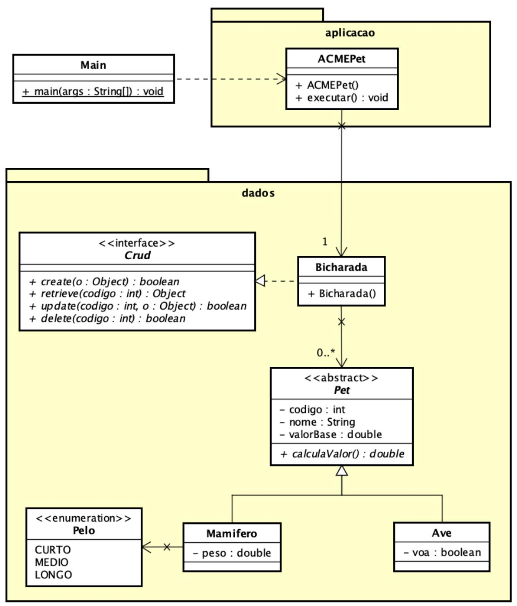

## Exercício avaliado com nota 10.0/10.0

### **Pontifícia Universidade Católica do Rio Grande do Sul Programação Orientada a Objetos Prof. Marcelo H. Yamaguti 2025/1**

# **Exercício de Avaliação 2**

#### 1. **Enunciado geral:**

A ACMEPet cuida de animais de estimação (*pets*) e deseja uma aplicação que faça o controle de dados dos pets.

Você será responsável pelo desenvolvimento da aplicação.

O analista de sistemas gerou um diagrama de classes inicial, com alguns atributos, operações e relacionamentos apresentados a seguir.

O analista definiu as seguintes operações da interface **Crud**:

- **create(Object)**: retorna true se o objeto foi inserido na coleção, ou false em caso contrário.
- **retrieve(int)**: retorna o objeto com o codigo indicado, ou *null* em caso contrário.
- **update(int,Object)**: retorna true se conseguiu atualizar o objeto com o codigo indicado, ou false em caso contrário.
- **delete(int)**: retorna true se conseguiu remover o objeto com o codigo indicado, ou false em caso contrário.

Sabe-se que será necessário haver subclasses da classe abstrata *Pet*. Cada subclasse possui informações adicionais específicas e a implementação do método calculaValor() depende da subclasse:

- *Ave*: se não voa é o valor base; se voa acrescenta 30% ao valor base.
- *Mamifero*: é calculado conforme tabela a seguir:

| Pelo  | Valor                           |
|-------|---------------------------------|
| CURTO | Acrescenta 10% ao valor base |
| MEDIO | Acrescenta 20% ao valor base |
| LONGO | Acrescenta 60% ao valor base |

O método **executar()** da classe ACMEPet deve realizar a sequência de passos:

- **1. Cadastrar aves**: lê todos os dados de cada ave do arquivo *'aves.csv'* e, se o código não for repetido no sistema, cadastra-a no sistema. Se o código for repetido mostra a mensagem no formato: **1: Erro: codigo repetido: codigo** Para cada ave cadastrada com sucesso no sistema, mostra os dados no formato: **1: codigo – nome – valorBase - voa**
- **2. Cadastrar mamíferos**: lê todos os dados de cada mamífero do arquivo *'mamiferos.csv'* e, se o código não for repetido no sistema, cadastra-o no sistema. Se o código for repetido mostra a mensagem no formato: **2: Erro: codigo repetido: codigo**

Para cada mamífero cadastrado com sucesso no sistema, mostra os dados no formato: **2: codigo – nome – valorBase – peso - pelo**

3. **Mostrar valores de todos os pets**: mostra os valores calculados de todos os pets. Se não existir pets cadastrados, mostra a mensagem de erro: **3: Nenhum pet cadastrado.**

Se existir, mostra os valores calculados de cada pet no formato: **3: valor**

4. **Mostrar pet com maior valor base**: mostra os dados do pet com maior valor base. Se não existir pets cadastrados, mostra a mensagem de erro: **3: Nenhum pet encontrado.**

Se existir, mostra os dados pet no seguinte formato: **4: codigo – nome – valor base - ...**

5. **Mostrar os dados de um determinado pet:** lê o código de um pet e mostra os seus dados. Se não existir pet com o código indicado, mostra a mensagem de erro: **5: Pet nao encontrado**.

Se existir, mostra os dados pet no seguinte formato: **5: codigo – nome – valor base - ...**

6. **Remover um determinado pet**: lê o código de um pet e o remove do sistema. Se não existir pet com o código indicado, mostra a mensagem de erro: **6: Pet nao encontrado**.

Se existir, mostra uma mensagem no formato: **6: Pet removido, codigo: codigo**

7. **Mostrar a quantidade de aves que voam**: mostra a quantidade de aves cadastradas que voam, no seguinte formato: **7: Quantidade de aves que voam: quantidade**

8. **Mostrar mamífero com pelo curto mais pesado**: mostra os dados do mamífero com pelo curto mais pesado do sistema. Se não existir mamífero de pelo curto, mostra a mensagem de erro: **8: Nenhum mamifero de pelo curto encontrado.** Se existir, mostra a mensagem no formato: **8: codigo – nome – valor base - peso - pelo**

#### **2. Definição do exercício:**

O objetivo do exercício é implementar um sistema que capaz de atender as necessidades da empresa descrita no enunciado geral, e que atenda as restrições a seguir:

- A entrada de dados ocorrerá por leitura de arquivo de texto.
	- o Pode-se utilizar de redirecionamento de E/S: ajuste a classe ACMEPet para ler e escrever em arquivos: veja na área Moodle da disciplina > módulo: Materiais de apoio > CÓDIGOS AUXILIARES > Redirecionamento de entrada/saída de dados para arquivos.
	- o Outra alternativa é a leitura e escrita em arquivos-texto.
- Os dados de entrada para os passos 5 e 6 estarão no arquivo *'dados.txt'*:
	- o Código do pet para ser consultado para o passo 5.
	- o Código do pet para ser removido para o passo 6.
- A saída de dados deve ser gravada no arquivo *'relatorio.txt'*.
- Toda entrada e saída de dados com o usuário deve ocorrer apenas na classe ACMEPet.
- Para cada passo do método executar() deve ser criado um método privado na classe ACMEPet.
- Para o armazenamento dos pets no sistema deve haver apenas uma lista de pets (List ou similar).
- Todos os atributos das classes devem ser privados.
- É permitida a criação de novos métodos, atributos e relacionamentos, mas as informações definidas no diagrama de classes original não podem ser alteradas.
- O diagrama de classes deve ser atualizado conforme as alterações realizadas e deve ser entregue em arquivo Astah ou PDF.

## **3. Critérios de avaliação**

O exercício será avaliado conforme os seguintes critérios:

- Diagrama de classes atualizado: 1 ponto.
- Implementação e uso de pacotes e enumeração: 1 ponto.
- Implementação e uso de generalização e interface: 2 pontos.
- Uso de polimorfismo: 1 ponto.
- Implementação correta conforme a descrição do exercício e o diagrama de classes: 2 pontos.
- Execução correta das opções previstas: 3 pontos.
	- o Haverá comparação do arquivo gerado pela sua solução com os arquivos-teste disponíveis no Moodle (comando diff no Linux ou comp no Windows)
- *Ponto extra (opcional) de 1 ponto (máximo de 10 pontos): implementação e execução correta do passo indicado:*
	- **Mostrar qual tipo de pelo possui mais mamíferos cadastrados**: identifica e mostra o tipo de pelo e a quantidade correspondente que possuir mais mamíferos cadastrados; em caso de empate, mostra o último. Se não existir nenhum mamífero cadastrado, mostra a mensagem de erro: **9: Nenhum mamifero cadastrado.** Se existir algum, mostra os dados no formato: **9: pelo - quantidade**

## 4. **Entrega:**

- A entrega do exercício envolverá:
	- o arquivos dos códigos-fonte do sistema (e demais arquivos necessários para a compilação do sistema).
- o diagrama de classes atualizado.
- Deverá ser gerado um arquivo compactado (.zip ou .rar), com os itens acima, e entregue na tarefa da área Moodle da disciplina.
- **Data de entrega: 21 / 5 / 2025.**
- 5. **Considerações finais:**
	- O exercício deve ser desenvolvido **individualmente**.
	- A implementação deve seguir o Java Code Conventions para nomes de identificadores e estruturas das classes.
	- Não será aceito exercício com erros de compilação. Programas que não compilarem corretamente terão nota zerada.
	- A cópia parcial ou completa do exercício terá como consequência a atribuição de nota 0 (zero) aos exercícios dos alunos envolvidos. Para análise de similaridade será utilizado o MOSS [\(https://theory.stanford.edu/~aiken/moss/\)](https://theory.stanford.edu/~aiken/moss/).
